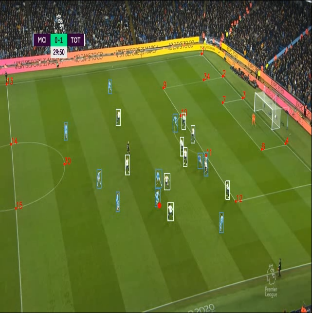
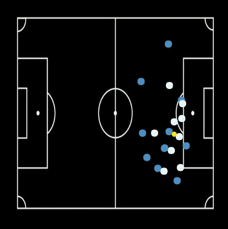

# Football Field Homography Estimation

This project is an application that captures live video from a moving camera for football field and converts the view into a top-down representation of a football field. This tool is designed for analyzing gameplay and tactics during football matches,

## Table of Contents
- [Introduction](#introduction)
- [Features](#features)
- [File Structure](#file-structure)
- [How It Works](#how-it-works)
- [Examples](#examples)
- [Getting Started](#getting-started)
  - [Installation](#installation)
  - [Usage](#usage)
  - [Custom Usage](#custom-usage)
- [Future Work](#future-work)
- [Contributing](#contributing)
- [License](#license)


## Introduction
This project is an application that captures live video from a moving camera for football field and converts the view into a top-down representation of a football field. This tool is designed for analyzing gameplay and tactics during football matches,

## Features
- [x] Work with static image
- [x] Work Live video
- [x] Detect field corners from frame
- [x] Detect players from frame
- [x] Track Players in real time (deepsort)
- [x] Cluster players into teams
- [x] Detect ball from frame
- [x] Homography estimation
- [x] Top-down view of the football field

## Files Structure
```bash
    ├── src
    │   ├── utils
    │   │   ├── utils.py
    │   │   └── drawing.py
    │   ├── BaseModel.py
    │   ├── CenterNet.py
    │   ├── cluster_package.py
    │   ├── detection_package.py
    │   ├── homography_package.py
    │   └── postprocess.py
    ├── images
    │   ├── field_est.jpg
    │   ├── field_est_labeld.jpg
    │   ├── test.gif
    │   └── test_output.jpg
    ├── models
    │   ├── corners_new.pt
    │   └── yolov5s.pt
    ├── main.py
    ├── requirements.txt
    ├── README.md
    └── LICENSE
```

- `src/`: 
    - `utils/`: contains some helper functions.
    - `BaseModel.py`: contains the base class for all models.
    - `CenterNet.py`: contains the class for detecting the ball from frame.
    - `cluster_package.py`: contains the class for clustering the detected players.
    - `detection_package.py`: contains the class for detecting the corners from frame.
    - `homography_package.py`: contains the class for estimating the homography of the field.
    - `postprocess.py`: contains the class for postprocessing the output of the model.
- `images/`: contains the images used in the readme.
- `models/`: contains the trained models.
- `main.py`: the main file.
- `requirements.txt`: contains the required packages.

## How it works

The project is divided into 7 main parts:
- Corner Detection
- Player detection
- Player Tracking and Clustering
- Ball Detection
- Ball Possession calculation
- Homography Estimation
- Homography Transform

1) **Corner Detection**: The first step consists on finding the coordinates of field corners like the image below,
using yolov8 train on custom dataset.
2) **Player detection**: The second step consists on detecting the players from frame using yolov8 train on custom dataset.
3) **Player Tracking and Clustering**: The third step consists on tracking the players with deep sort tracker and clustering them into teams with kmeans clustering.
4) **Ball Detection**: The fourth step consists on detecting the ball from frame using CenterNet train on custom dataset.
5) **Ball Possession calculation**: the fifth step consists of calculating the time of the ball with every team to calculate possession.
6) **Homography Estimation**: The 6th step consists on estimating the homography of the field using the detected corners.
7) **Homography Transform**: in the last step consists on using homography to transform the view of the field into a top-down view and get the players and ball position in 2d top-down view img.


as you can see here there are 30 points, then the detection model is trying to detect at least 4 of them from frame.


the next step is detect players and ball and cluster teams.



then we transform the view of the field into a top-down view and get the players and ball position in 2d top-down view img.



## Examples


## Getting Started
### Installation
1. Clone the repo
   ```sh
   git clone https://github.com/m7mdGNo/football_analysis.git
    ```
2. Install requirements
    ```sh
    pip install -r requirements.txt
    ```
### Usage
- download weights from here https://drive.google.com/drive/folders/1dAHpSjJ6kax7ONfPJdeRHgpvxCueruPq?usp=sharing
- put the weights in /models dir
- To run the code on a static image or on a video
    ```sh
    python main.py --input <path to image/video>  --output <path to output image/video>
    ```
- note: if the source is img/video the output must the img/video
- this command will save img/video in the output dir
- for custom usage see Custom Usage content

### Custom Usage
- Import Libraries
    ```python
    from src.utils.drawing import draw_player_point,draw_player_rect,draw_point
    from src.homography_package import get_transformed_point
    from src.utils.utils import get_player_point,calculate_distance
    from src.cluster_package import cluster_players_team,predict_team
    from deep_sort_realtime.deepsort_tracker import DeepSort
    from src.BaseModel import BaseModel
    from ultralytics import YOLO
    import cv2
    import numpy as np
    ```
- Load the model
    ```python
    corners_model = YOLO('models/corners_new4.pt')
    game_objects_model = YOLO('models/game_objects2.pt')
    basemodel = BaseModel(corners_model,game_objects_model)
    ```
- Work on Image
    ```python
    img = cv2.imread('images/test.jpg')
    # get the cordinates of all detected corners in an image
    corners = basemodel.detect_pitch_corners(img)
    # draw the corners on the image
    img = basemodel.draw_corners(img,corners)
    # detect players in img
    players = basemodel.detect_game_objects(frame,conf=.8)
    # prepare players for clustering
    players_for_cluster = []
    for player in players:
        players_for_cluster.append([player[0][0],player[0][1],player[0][0]+player[0][2],player[0][1]+player[0][3]])
    # cluster players into teams
    sucess,basemodel.colors = cluster_players_team(frame,players_for_cluster,basemodel.cluster_model)
    # draw players on the image
    for player in players:
        team = predict_team(player,frame,basemodel.cluster_model)
        draw_player_rect(img,player,basemodel.colors[team])
    # detect ball
    ball,last_loc = basemodel.detect_ball(frame_copy,last_loc=None)
    # draw ball on the image
    draw_point(img,ball)
    # get the top down view of the image
    top_view_H = basemodel.get_top_view_homography(corners,thresh=80)
    # transform points using homography matrix and show them on the original frame
    for player in players:
        x,y = get_player_point(player)
        x,y = get_transformed_point(x,y,top_view_H)
        draw_player_point(img,(x,y),basemodel.colors[team],size=10)
    if ball:
        transformed_ball = list(get_transformed_point(ball,np.array(top_view_H)))
        x,y = transformed_ball
        draw_point(img,(x,y),size=10)
    # get the merge view of the image and the transformed 2d top-down view field img
    mrg_view_H = basemodel.get_merge_view_homography(corners,thresh=80)

    ```
- Work on Video
    ```python
    last_loc = None
    teams_clustered = False
    cap = cv2.VideoCapture('videos/test.mp4')
    while True:
        ret, frame = cap.read()
        if not ret:
            break
        
        # get the cordinates of all detected corners in an image
        corners = basemodel.detect_pitch_corners(frame)
        # draw the corners on the image
        frame = basemodel.draw_corners(frame,corners)
        # detect players in img
        players = basemodel.detect_game_objects(frame,conf=.8)
        # prepare players for clustering
        if not teams_clustered:
            players_for_cluster = []
            for player in players:
                players_for_cluster.append([player[0][0],player[0][1],player[0][0]+player[0][2],player[0][1]+player[0][3]])
            # cluster players into teams
            sucess,basemodel.colors = cluster_players_team(frame,players_for_cluster,basemodel.cluster_model)
            teams_clustered = True
        # draw players on the image
        for player in players:
            team = predict_team(player,frame,basemodel.cluster_model)
            draw_player_rect(frame,player,basemodel.colors[team])
        # detect ball
        ball,last_loc = basemodel.detect_ball(frame_copy,last_loc=last_loc)
        # draw ball on the image
        draw_point(frame,ball)
        # get the top down view of the image
        top_view_H = basemodel.get_top_view_homography(corners,thresh=80)
        # transform points using homography matrix and show them on the original frame
        for player in players:
            x,y = get_player_point(player)
            x,y = get_transformed_point(x,y,top_view_H)
            draw_player_point(frame,(x,y),basemodel.colors[team],size=10)
        if ball:
            transformed_ball = list(get_transformed_point(ball,np.array(top_view_H)))
            x,y = transformed_ball
            draw_point(frame,(x,y),size=10)

        cv2.imshow('frame', mrg_view)
        if cv2.waitKey(1) & 0xFF == ord('q'):
            break
    cap.release()
    cv2.destroyAllWindows()
    ```
    
- note: the model is trained on custom dataset, so it may not work well, also it's under developing.

## Feuture Work
- [ ] Train the model on more data.
- [ ] Add players detection.
        - estimate speed.
        - estimate distance.
- [ ] Add smoothness for video.
- [ ] Add GUI.


## Contributing
Pull requests are welcome. For major changes, please open an issue first to discuss what you would like to change.

## License
Distributed under the MIT License. See `LICENSE` for more information.
