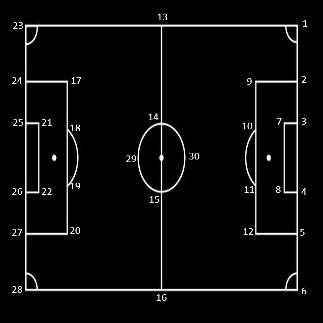
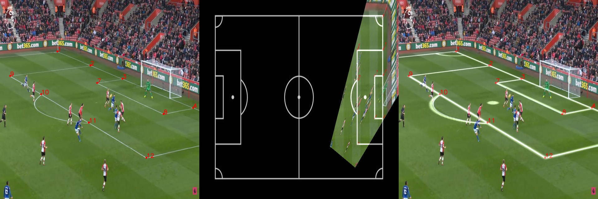

# Football Field Homography Estimation

This project is an application that captures live video from a moving camera for football field and converts the view into a top-down representation of a football field. This tool is designed for analyzing gameplay and tactics during football matches,

## Table of Contents
- [Introduction](#introduction)
- [Features](#features)
- [File Structure](#file-structure)
- [How It Works](#how-it-works)
- [Examples](#examples)
- [Getting Started](#getting-started)
  - [Installation](#installation)
  - [Usage](#usage)
  - [Custom Usage](#custom-usage)
- [Future Work](#future-work)
- [Contributing](#contributing)
- [License](#license)


## Introduction
This project is an application that captures live video from a moving camera for football field and converts the view into a top-down representation of a football field. This tool is designed for analyzing gameplay and tactics during football matches,

## Features
- [x] Work with static image
- [x] Work Live video
- [x] Detect field corners from frame
- [x] Homography estimation
- [x] Top-down view of the football field

## Files Structure
```bash
    ├── src
    │   ├── utils
    │   │   ├── utils.py
    │   │   └── drawing.py
    │   ├── BaseModel.py
    │   ├── cluster_package.py
    │   ├── detection_package.py
    │   ├── homography_package.py
    │   └── postprocess.py
    ├── images
    │   ├── field_est.jpg
    │   ├── field_est_labeld.jpg
    │   ├── test.gif
    │   └── test_output.jpg
    ├── models
    │   ├── corners_new.pt
    │   └── yolov5s.pt
    ├── main.py
    ├── requirements.txt
    ├── README.md
    └── LICENSE
```

- `src/`: 
    - `utils/`: contains some helper functions.
    - `BaseModel.py`: contains the base class for all models.
    - `cluster_package.py`: contains the class for clustering the detected players.
    - `detection_package.py`: contains the class for detecting the corners from frame.
    - `homography_package.py`: contains the class for estimating the homography of the field.
    - `postprocess.py`: contains the class for postprocessing the output of the model.
- `images/`: contains the images used in the readme.
- `models/`: contains the trained models.
- `main.py`: the main file.
- `requirements.txt`: contains the required packages.

## How it works

The project is divided into 3 main parts:
- Detection
- Homography Estimation
- Homography Transform

1) **Detection**: The first step consists on finding the coordinates of field corners like the image below,
using yolov8 train on custom dataset.
2) **Homography Estimation**: The second step consists on estimating the homography of the field using the detected corners.
3) **Homography Transform**: iThe last step consists on using homography to transform the view of the field into a top-down view.




as you can see here there are 30 points, then the detection model is trying to detect at least 4 of them from frame.


## Examples



## Getting Started
### Installation
1. Clone the repo
   ```sh
   git clone https://github.com/m7mdGNo/football_analysis.git
    ```
2. Install requirements
    ```sh
    pip install -r requirements.txt
    ```
### Usage
- To run the code on a static image or on a video
    ```sh
    python main.py --input <path to image/video>  --output <path to output image/video>
    ```
- note: if the source is img/video the output must the img/video
- this command will save img/video in the output dir
- for custom usage see Custom Usage content

### Custom Usage
- Import Libraries
    ```python
    from src.BaseModel import BaseModel
    from ultralytics import YOLO
    import cv2
    import numpy as np
    ```
- Load the model
    ```python
    corners_model = YOLO('models/corners_new.pt')
    basemodel = BaseModel(corners_model)
    ```
- Work on Image
    ```python
    img = cv2.imread('images/test.jpg')
    # get the cordinates of all detected corners in an image
    corners = basemodel.detect_pitch_corners(img)
    # draw the corners on the image
    img = basemodel.draw_corners(img,corners)
    # get the top down view of the image
    top_view,_ = basemodel.get_top_view(img, corners)
    # get the merge view of the image and the transformed 2d top-down view field img
    mrg_view,_ = basemodel.get_merge_view(img,corners)

    ```
- Work on Video
    ```python
    cap = cv2.VideoCapture('videos/test.mp4')
    while True:
        ret, frame = cap.read()
        if not ret:
            break
        # get the cordinates of all detected corners in an image
        corners = basemodel.detect_pitch_corners(frame)
        # draw the corners on the image
        frame = basemodel.draw_corners(frame,corners)
        # get the top down view of the image
        top_view,_ = basemodel.get_top_view(frame, corners)
        # get the merge view of the image and the transformed 2d top-down view field img
        mrg_view,_ = basemodel.get_merge_view(frame,corners)
        cv2.imshow('frame', mrg_view)
        if cv2.waitKey(1) & 0xFF == ord('q'):
            break
    cap.release()
    cv2.destroyAllWindows()
    ```
    
- note: the model is trained on custom dataset, so it may not work well, also it's under developing.

## Feuture Work
- [ ] Train the model on more data.
- [ ] Add players detection.
        - cluster teams.
        - track players.
        - estimate speed.
        - estimate distance.
- [ ] Estimate ball position.
- [ ] Add smoothness for video.
- [ ] Add GUI.


## Contributing
Pull requests are welcome. For major changes, please open an issue first to discuss what you would like to change.

## License
Distributed under the MIT License. See `LICENSE` for more information.
